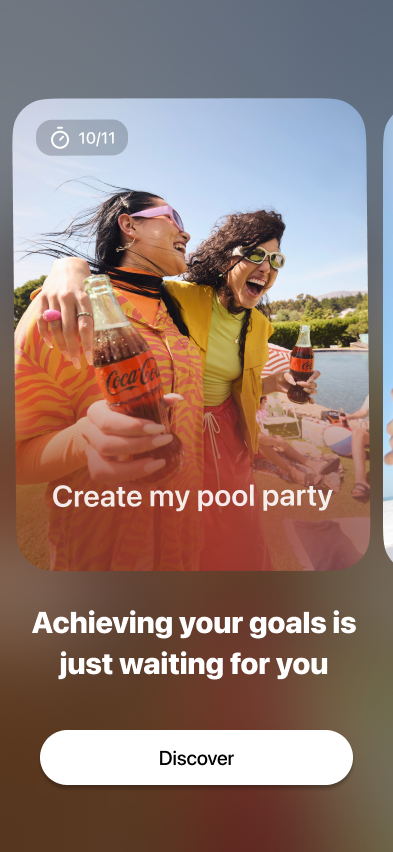

# 🚀 Sublimate

> **Turn your ideas into finished projects, one step at a time.**  
> *Make progress visible, fun, and unstoppable.*

 

## 📖 About The Project

We all have ideas, goals, and dreams. But let’s be honest: almost everyone has started a project they never finished. 

**Why?** Because motivation fades. Progress is hard to see. We forget why we started, and existing productivity tools are often cold, complex, and impersonal. 

**Sublimate** is a mobile application designed to fix this. We believe that achieving your goals shouldn't feel like a chore. Inspired by the gamified and engaging approach of apps like Duolingo, Sublimate helps you finish what you start by making your progress highly visual and rewarding.

### ✨ How It Works

1. **Create your project:** Give your goal a name and a purpose.
2. **Break it down:** Split your big project into small, manageable steps.
3. **Set deadlines:** Assign a target date for each step to keep the momentum going.
4. **Capture the proof:** Take a photo to prove the step is done and celebrate the small wins.
5. **See the magic:** Once the project is complete, Sublimate uses AI to generate a short, dynamic video compiling your photos, showcasing your entire journey from start to finish.

### 🎯 Who Is It For?

While anyone can use Sublimate to renovate a room or read 10 books, the app is primarily built for:
- 🎓 **Students:** To prepare for exams step-by-step.
- 🎨 **Young Creators:** To showcase their creative process and behind-the-scenes work.
- 🏃 **Athletes:** To track training goals and physical transformations.

### 💎 Our Values
- **Determination:** Pushing through the friction of getting started.
- **Achievement:** Celebrating every step, no matter how small.
- **Creativity:** Building a positive, motivating community of people who share their progress.

## 🛠 Technical Overview

Behind the smooth user experience is a robust, modern tech stack designed for scalability, performance, and cross-platform compatibility. 

### 📱 Mobile Application (Frontend)
- **Framework:** [React Native](https://reactnative.dev/) powered by [Expo](https://expo.dev/) for seamless iOS and Android development.
- **State Management:** [Zustand](https://github.com/pmndrs/zustand) for a fast, minimalist, and scalable global state.
- **Device Integrations:**
  - **Permissions Management:** Handled natively through Expo to ensure privacy and security.
  - **Camera & Gallery:** Direct access to capture and upload photo proofs of completed steps.
  - **Push Notifications:** To send friendly reminders, deadline alerts, and motivation boosts.

### ⚙️ Backend & Infrastructure
- **BaaS (Backend as a Service):** [Supabase](https://supabase.com/) serves as the core backend infrastructure.
- **Authentication:** Supabase Auth integrated with **Social Providers** (Google/Apple) for quick, frictionless onboarding.
- **Database:** PostgreSQL (via Supabase) for secure relational data management (Users, Projects, Steps).
- **Media Storage:** Supabase **Storage Buckets** are used to securely host user-uploaded images and the final AI-generated videos.

### 💻 Admin Dashboard
- **Framework:** [Next.js](https://nextjs.org/) (React).
- **Purpose:** A dedicated, external web dashboard used by the core team to manage the application, monitor community engagement, moderate content, and oversee the backend infrastructure easily.
